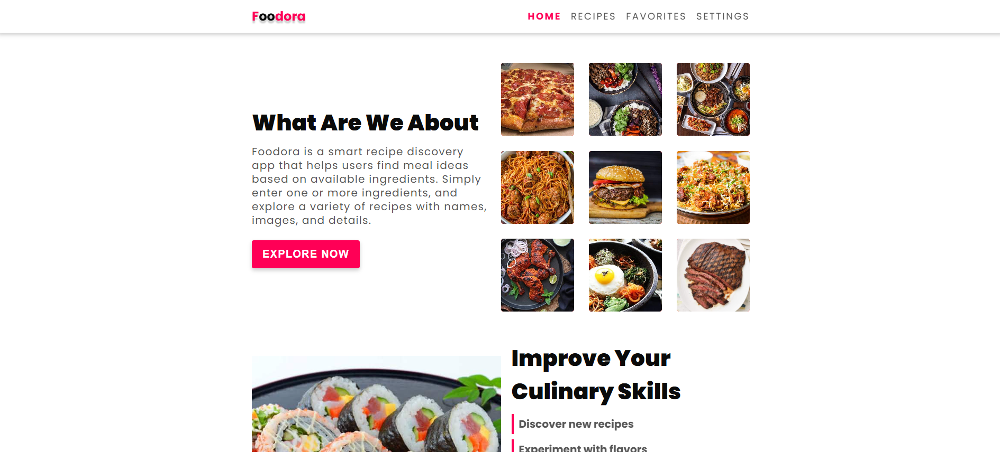
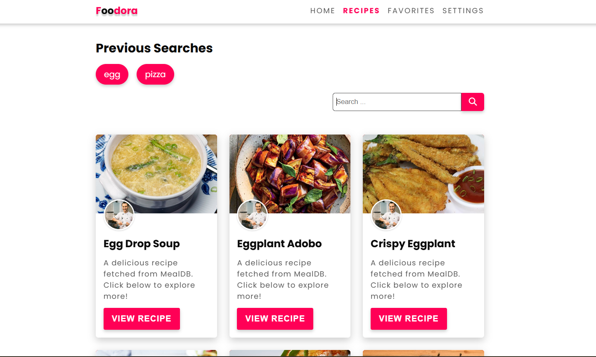

🍲 Foodora – Recipe Finder App

Foodora is a recipe discovery web application built with React.
It helps users search meals by ingredients, view cooking instructions, and explore different cuisines using the TheMealDB API: https://www.themealdb.com/api.php




Features:-

🔎 Search by Ingredients – Find meals using one or more ingredients.
🖼️ Meal Thumbnails – Browse meals with images and names.
📖 Recipe Details – Click on a meal to see ingredients and cooking instructions.
❌ Error Handling – Shows a friendly message when no results are found.
Settings / Personalization – Customize color theme, text size, site theme (light/dark), and animation speed for a tailored experience.
📱 Responsive Design – Works smoothly on desktop and mobile.




🛠️ Tech Stack:-

Frontend: React, React Router
Styling: SCSS / CSS Variables / Tailwind CSS (choose based on your setup)
Icons: FontAwesome / React Icons
API: TheMealDB- https://www.themealdb.com/api/json/v1/1/filter.php?i={ingredient}

📂 Project Structure:-
```
MealRecipe/
│
├── src/
│   ├── assets/                  # Images, icons, logos
│   │
│   ├── Components/              # Reusable React components
│   │   ├── CustomImage.jsx
│   │   ├── Favorites.jsx
│   │   ├── Footer.jsx
│   │   ├── HeroSection.jsx
│   │   ├── ImproveSkills.jsx
│   │   ├── Navbar.jsx
│   │   ├── PreviousSearch.jsx
│   │   ├── QuoteSection.jsx
│   │   ├── RecipeCard.jsx
│   │   ├── RecipeDetails.jsx
│   │   └── Sidebar.jsx
│   │
│   ├── pages/                   # Page-level components
│   │   ├── Home.jsx
│   │   ├── Recipes.jsx
│   │   └── Settings.jsx
│   │
│   ├── styles/                  # SCSS/CSS files
│   │   ├── partials/            # SCSS partials
│   │   │   ├── _animation.scss
│   │   │   ├── _footer.scss
│   │   │   ├── _herosection.scss
│   │   │   ├── _navbar.scss
│   │   │   ├── _quotesection.scss
│   │   │   ├── improvedskills.scss
│   │   │   └── recipes.scss
│   │   │
│   │   ├── index.scss           # Main SCSS entry
│   │
│   ├── App.jsx                  # Main React App component
│   └── index.js                 # Entry point for React
│
├── index.html                   # HTML template
├── main.js / main.jsx           # Vite or React entry
├── package.json
├── package-lock.json
└── eslint.config.js

```

